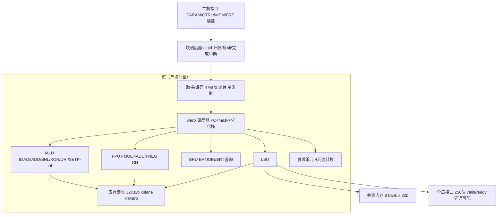

# Golden Kernel 专用 GPGPU：ISA 与微架构草案

版本：v0.1（草案）
日期：2026-08-22
设计输入：`~/sim_run/shmem_diverge.cu` 及其 PTX（PTX ISA 6.4 / sm_70，nvcc 10.1，`-fmad=false`）
基线：GPGPU-Sim 4.2.0，SM7_TITANV 配置

---

## 1. 设计定位与总体决策

本硬件是"单 kernel 机器"：只执行 shmem_diverge 这一个 kernel，并以它为唯一调试验证目标。因此 ISA 按该 kernel 实际用到的指令做极简裁剪，微架构按"最小验证配置"定标，不追求与 GPGPU-Sim 的性能数字直接对齐，而是追求**最快跑通功能闭环 + 可用归一化指标与基线对照**。

### 1.1 Golden kernel 语义回顾

- 参数：`in`（FP32 数组）、`out`（FP32 数组）、`n`（元素数，基准实例 N=1000）
- 网格：grid = ceil(N/256) = 4 块 × 256 线程；块内 `__shared__ float tile[256]`
- 行为：边界保护（`gid<n` 才取数）→ 写 `tile[tid]` → `__syncthreads` → 读 `tile[tid^0x80]`（块内邻居交换）→ 数据相关分支（x>0 走 8 轮 `r=r*1.0001f+0.0001f`，否则 `r=-x`）→ 边界保护 → 写回
- 输入数据 `in[i]=((i%7)-3)*100`：正负交错，保证每个 warp 内必然发生数据分支分化

### 1.2 关键设计决策一览

| 决策 | 选择 | 理由 |
|---|---|---|
| 指令集范围 | 极简专用，20 条指令 | 只覆盖 golden kernel 实际用到的操作 |
| 数据宽度 | 32 位整数/FP32 统一 | kernel 无 64 位运算需求（见下） |
| 地址空间 | 32 位物理地址 | 消除 `cvta`/`mul.wide.s32`/`add.s64` 共 6 条地址拼接指令 |
| 寄存器文件 | 整数/浮点统一（32×32 位），R0 恒零 | 消除 `mov` 跨域搬运，`v=0.0f` 直接用 R0 |
| FMA | 不提供 | 基线编译用 `-fmad=false`，乘加分离是语义要求 |
| 执行规模 | 默认 8 lane × 4 warp = 32 线程/块，块串行 | 最小验证配置，参数可在 RTL 编译期改；warp/block 调度策略为后续演进项（见 §7） |
| 缓存/预测 | 无 cache、无分支预测 | 验证优先，时序可预期 |
| 分化处理 | active mask + 分化栈 + BR/JOIN + 重聚表（BRT） | 静态重聚点，硬件无需分析控制流 |

**64 位地址指令的消除**：PTX 里每次全局访存都要 `cvta.to.global.u64` + `mul.wide.s32`（gid×4）+ `add.s64`（基址+偏移）共 3 条。本设计把 kernel 基址做成 32 位参数寄存器，偏移由 `SHL #2` 一条完成，寻址模式为 `R[base]+R[off]`，每次访存净省 2 条指令。

---

## 2. ISA 规范

### 2.1 数据类型与编程模型

- 唯一数据类型：32 位字（整数补码 / IEEE-754 FP32，共用寄存器，按指令解释）
- 执行单位：warp = LANES 个 lane（默认 8）；块 = WARPS 个 warp（默认 4，即 32 线程/块）；网格 = 若干块**串行**执行（多块并发驻留为后续特性）
- 全部 lane 始终物理执行；边界"无效线程"由程序逻辑（谓词分支）处理，与 CUDA 语义一致（越界线程仍运行，只是跳过取数/写回，并向共享内存写 0）

### 2.2 寄存器模型（每 warp 私有）

| 资源 | 数量 | 说明 |
|---|---|---|
| GPR R0–R31 | 32 × 32 位/lane | R0 硬件恒零；整数/浮点共用 |
| 谓词 P0–P3 | 4 × 1 位/lane | 仅 SETP 写、BR 读；无谓词执行的 ALU 指令 |
| 分化栈 | 深度 4 | 表项 {pc, mask}，见 2.6 |
| active mask | LANES 位 | 当前有效 lane 集合 |

特殊寄存器（CSRR 读取，只读）：

| 编号 | 名称 | 含义 | 对应 PTX |
|---|---|---|---|
| 0 | TID | 块内线程号（0..31） | `%tid.x` |
| 1 | NTID | 块大小（=32） | `%ntid.x` |
| 2 | CTAID | 当前块号（硬件块调度器维护） | `%ctaid.x` |

### 2.3 Kernel 参数与主机寄存器

主机（host）通过简单寄存器接口配置并启动 kernel：

| 偏移 | 寄存器 | 读写 | 说明 |
|---|---|---|---|
| 0x00 | PARAM0 | RW | `in` 基址（32 位物理地址） |
| 0x04 | PARAM1 | RW | `out` 基址 |
| 0x08 | PARAM2 | RW | n（元素个数） |
| 0x0C | SHBASE | RW | 本 kernel 共享内存窗口基址 |
| 0x10 | GRID | RW | 块总数（N=1000 时 = 32） |
| 0x14 | CTRL | W | bit0 = start |
| 0x18 | STATUS | R | bit0 busy / bit1 done |
| 0x1C | DBG_BLOCK | R | 已完成块计数（调试） |
| 窗口 | IMEM / BRT | W | 指令存储器与重聚表装载口 |

`LDP rd, #k` 读 PARAM0..2。注意：原 CUDA 的 64 位指针在装载前由主机驱动完成地址映射/截断为 32 位物理基址——这是本设计的明确简化点。

### 2.4 指令编码（定长 32 位，小端，按字取指）

```
R3 型（仅 IMAD）:  [31:26]op | [25:21]rd | [20:16]ra | [15:11]rb | [10:6]rc | [5:0]保留
R  型:             [31:26]op | [25:21]rd | [20:16]ra | [15:11]rb | [10:0]保留/mode
I  型:             [31:26]op | [25:21]rd | [20:16]ra | [15:0]imm16
L  型（仅 LUI）:   [31:26]op | [25:21]rd | [20:1]imm20 | [0]保留
M  型（访存）:     [31:26]op | [25:21]rt | [20:16]ra   | [15:11]rb | [10:0]保留
S  型（仅 SETP）:  [31:26]op | [25:24]pd | [23]保留 | [22:18]ra | [17:13]rb
                   | [12]fmt(0=int,1=fp) | [11:9]cond | [8:0]保留
B  型（BR/JOIN）:  [31:26]op | [25:24]psel | [23]u(1=无条件) | [22]neg
                   | [21:0]imm22（有符号，字偏移，±2M 字）
```

- I 型/R 型区分：IADD 与 SHL 以 **bit[15]** 为模式位（0=寄存器源，1=立即数源），立即数占 [14:0] 共 15 位：IADD 符号扩展（±16k），SHL 取低 5 位；ORI 恒为立即数型，[15:0] 零扩展（专用于常数低 16 位拼接）。（勘误：原稿模式位误写为 bit[10]，与立即数域冲突；ptx2gold 工具链与后续 RTL 均以 bit[15] 为准。）
- B 型 psel：00–11 分别选 P0–P3；u=1 时无视谓词（等价 `bra.uni` / 恒真）。
- SETP cond 编码：000 lt / 001 le / 010 eq / 011 ne / 100 ge / 101 gt。
- BRT（重聚表）不属于指令流：由汇编器为每条可能分化的 BR 生成表项 `{分支PC → 重聚PC}`，主机随程序一起装载，深度 8。

### 2.5 指令表（20 条）

| op | 助记符 | 格式 | 语义 | 对应 PTX |
|---|---|---|---|---|
| 0x01 | IMAD | R3 | R[rd] = (R[ra]×R[rb] + R[rc]) 低 32 位（有符号） | `mad.lo.s32` |
| 0x02 | IADD | R/I | R[rd] = R[ra] + (R[rb] 或 sext(imm15))；imm=0 时即 `mov` | `add.s32`、`mov.u32` |
| 0x03 | SHL | R/I | R[rd] = R[ra] << (低 5 位) | `shl.b32` |
| 0x04 | XOR | R | R[rd] = R[ra] ^ R[rb] | `xor.b32` |
| 0x05 | ORI | I | R[rd] = R[ra] \| zext(imm16) | （常数低位拼接） |
| 0x06 | LUI | L | R[rd] = imm20 << 12 | （常数高位拼接） |
| 0x07 | SETP | S | P[pd] = cmp(R[ra], R[rb])，fmt 选整数/FP32 | `setp.ge.s32`、`setp.gt.f32` |
| 0x08 | FMUL | R | R[rd] = R[ra] × R[rb]，IEEE-754 RN | `mul.rn.f32` |
| 0x09 | FADD | R | R[rd] = R[ra] + R[rb]，IEEE-754 RN | `add.rn.f32` |
| 0x0A | FNEG | R | R[rd] = −R[ra]（符号位取反） | `neg.f32` |
| 0x0B | LDG | M | R[rt] = GMem32[R[ra]+R[rb]]，4 字节对齐 | `ld.global.nc.f32` |
| 0x0C | STG | M | GMem32[R[ra]+R[rb]] = R[rt] | `st.global.f32` |
| 0x0D | LDS | M | R[rt] = SMem32[SHBASE+R[rb]] | `ld.shared.f32` |
| 0x0E | STS | M | SMem32[SHBASE+R[rb]] = R[rt] | `st.shared.f32` |
| 0x0F | LDP | P | R[rd] = PARAM[k]，k∈{0,1,2} | `ld.param.u64/u32` |
| 0x10 | CSRR | P | R[rd] = SREG[k]，k∈{TID,NTID,CTAID} | `mov.u32 %tid.x` 等 |
| 0x11 | BR | B | 谓词/无条件分支（见 2.6） | `@%p bra`、`bra.uni` |
| 0x12 | JOIN | B | 汇合指令：分化栈协调（见 2.6） | 汇编器生成，替代路径末尾的 `bra.uni` |
| 0x13 | BAR | — | 块级屏障：等本块全部 warp 到达后一起释放 | `bar.sync 0` |
| 0x14 | RET | — | warp 结束；本块全部 warp 结束 → 块完成 | `ret` |

被裁剪的 PTX 指令及替代方案：

| 被裁指令 | 数量 | 替代方案 |
|---|---|---|
| `cvta.to.global.u64` | 2 | 32 位地址空间，基址直接来自 PARAM |
| `mul.wide.s32`、`add.s64` | 4 | LDG/STG 的 base+offset 寻址 + `SHL #2` |
| `mov.f32 0.0` | 1 | `IADD rd, r0, #0`（R0 恒零） |
| `mov.u32 tile符号地址` | 1 | SHBASE CSR，LDS/STS 隐含使用 |
| `bra.uni`（路径末尾） | 3 | 改写为 JOIN |

### 2.6 控制流与分化模型

**基本规则**：所有算术/访存指令无条件执行、仅作用于 active mask 内的 lane；谓词只出现在 BR 的条件域。

**JOIN 语义**（核心机制，设为独立指令以便验证）：

```
JOIN R:
  if  栈非空 且 栈顶.pc == R:   mask ← 栈顶.mask; 弹栈; pc ← R
  elif 栈非空:                  pc ← 栈顶.pc;  mask ← 栈顶.mask; 弹栈
  else:                         pc ← R        （等价普通跳转）
```

**分化分支执行序列**（以数据分支为例，`BR p2, L3` 的重聚点为 S0，由 BRT 提供）：

```
若 taken 与 not-taken 两侧都有活动 lane（分化）:
    push(S0, 全量mask);  push(下一条, not_taken_mask)
    pc ← L3;  mask ← taken_mask            ; 先执行"长路径"
长路径末尾 JOIN S0:  栈顶=(下一条,nt) ≠ S0 → 弹出,跳回"短路径"
短路径末尾 JOIN S0:  栈顶=(S0,全量) 匹配  → 恢复全量 mask, pc ← S0
```

单侧分支（边界跳过型 `BR p1, L1`）：分化时只 `push(L1, 全量mask)`，落入侧以收窄 mask 执行，其末尾 `JOIN L1` 恢复。**均匀分支不压栈**（栈空时 JOIN 退化为普通跳转，天然兼容）。

**约束**：栈深 4（本 kernel 最大嵌套深度为 2，含顺序复用）；BAR 必须在已汇合（全量 mask）的程序点执行——本 kernel 的 BAR 位于边界分支重聚之后，满足该约束，硬件对"带分化状态撞屏障"报错停机以便调试。

---

## 3. 微架构

### 3.1 顶层框图



### 3.2 前端与 warp 调度

- 4 个 warp 上下文，轮转仲裁，每周期至多发射 1 条（单发射、顺序）。仲裁逻辑与上下文存储解耦，为后续替换调度策略（GTO/oldest-first/优先级）预留接口（见 §7）。
- 取指无预测：遇到 BR/JOIN 在 EX 级解析，前端暂停 1 周期（可接受：本程序分支密度约 6/49）。
- 每周期上下文切换零开销：4 个 warp 的 PC/mask/栈/谓词全部常驻触发器。

### 3.3 执行单元

| 单元 | 功能 | 延迟 | 说明 |
|---|---|---|---|
| IALU | IMAD/IADD/SHL/XOR/ORI/LUI/SETP(int) | 1 | 乘法器默认单周期；面积优先可换 8 周期迭代式（IMAD 全程只执行 1 次/线程） |
| FPU | FMUL/FADD/FNEG，IEEE-754 RN | 1 | 无 FMA、无 sqrt/div；subnormal 建议 FTZ（本算法数值范围不触发，需在验证中确认） |
| BRU | BR/JOIN、BRT 查询、分化栈压弹 | 1 | BRT 为 8 表项小表，按分支 PC 索引 |
| LSU | LDG/STG/LDS/STS | 共享 1 / 全局阻塞 | 见 3.4 |

### 3.4 存储子系统

**共享内存**：容量参数化（默认 256 B，覆盖 32 线程块所需 128 B 的 2 倍余量）；bank 数 = LANES = 8，字粒度交织（`bank = word_addr[2:0]`）。本 kernel 的 `tile[tid]` 与 `tile[tid^MASK]` 都是置换访问，无 bank conflict（与基线一致）。冲突时硬件串行化（不报错），并输出 conflict 计数供调试。

**全局接口**：256 位数据总线（8 lane × 32 位），valid/ready 握手；对齐连续访问一拍完成，非对齐按 lane 拆分。每 warp 同一时刻最多 1 个在途请求，**阻塞式**（数据未回，该 warp 停发，调度器切其他就绪 warp）。存储延迟 MEM_LAT 参数化，默认 20 周期。不做 cache、不做合并缓存行——两个访存点（载入/写回）各自天然连续，硬件按整 warp 单拍收发即可。

### 3.5 屏障单元

3 位到达计数器（计至 WARPS=4）+ 释放逻辑：warp 执行 BAR 后计数并阻塞；计数到 4 后全部同拍释放并清零。WARPS 增大时仅需加宽计数器。STS 为 1 周期同步写入，释放时共享内存天然一致，无需额外栅栏。

### 3.6 流水线与冒险

三级：IF/ID → EX → WB。

- 顺序发射 + 寄存器记分板：EX→EX 旁路；写后读 1 周期冒险由旁路覆盖，旁路未覆盖的组合停顿。
- 访存停顿：LDS 结果次拍可用（依赖紧跟则 1 气泡）；LDG 阻塞 warp 直到数据返回。
- 谓词冒险：SETP→BR 相邻（本程序恰好如此），谓词文件在 EX 级前递，免气泡。
- 无结构冒险（各单元单份、访存串行化由 LSU 内部排队）。

### 3.7 复位与块切换

块完成：全部 warp RET → 块调度器 ctaid+1 → 清零各 warp（PC=0、mask=全 1、栈空、谓词清零）→ 下一块。**共享内存不清零**（每块所有线程都会重写 `tile[tid]`，越界线程写 0，与 CUDA 语义一致）。全部块完成 → done 中断。

---

## 4. Golden kernel 映射

### 4.1 手工汇编（最小配置实例，MASK=16；原始规模 MASK=128）

```asm
; ---- 序言：参数/特殊寄存器 ----
00  LDP   r1, #0            ; in_base
01  LDP   r2, #1            ; out_base
02  LDP   r3, #2            ; n
03  CSRR  r4, NTID
04  CSRR  r5, CTAID
05  CSRR  r6, TID
06  IMAD  r7, r4, r5, r6    ; gid = ntid*ctaid + tid
07  SHL   r11, r7, #2       ; 字节偏移（提前，供取数/写回复用）
08  IADD  r10, r0, #0       ; v = 0.0f
; ---- 边界保护 + 全局取数 ----
09  SETP  p1, r7, r3, I_GE  ; p1 = (gid >= n)
0A  BR    p1, L1            ; 越界跳过取数（单侧分化，BRT: 0A→0D）
0B  LDG   r10, r1, r11      ; v = in[gid]
0C  JOIN  L1                ; 重聚，恢复全量 mask
L1:
; ---- 共享内存写 + 屏障 ----
0D  SHL   r12, r6, #2
0E  STS   r12, r10          ; tile[tid] = v
0F  BAR
; ---- 邻居交换读 ----
10  IADD  r9, r0, #16       ; MASK = 块大小/2（原始规模 = 128）
11  XOR   r13, r6, r9       ; tid ^ MASK
12  SHL   r13, r13, #2
13  LDS   r14, r13          ; x = tile[tid^MASK]
; ---- 数据分支（BRT: 15→2D） ----
14  SETP  p2, r14, r0, F_GT ; p2 = (x > 0.0f)
15  BR    p2, L3            ; 正数 → 长路径
16  FNEG  r14, r14          ; 短路径：r = -x
17  JOIN  S0
L3:
18  LUI   r15, #0x3F800     ; 1.0001f 高位
19  ORI   r15, r15, #0x0347
1A  LUI   r16, #0x38D1B     ; 0.0001f 高位
1B  ORI   r16, r16, #0xB717
1C  FMUL  r14, r14, r15     ; ×8 轮，展开
1D  FADD  r14, r14, r16
    ...                     ; （共 FMUL/FADD 各 8 条，至 2B）
2C  JOIN  S0
S0:
; ---- 边界保护 + 全局写回 ----
2D  BR    p1, L5            ; 越界跳过写回（BRT: 2D→30）
2E  STG   r2, r11, r14      ; out[gid] = r（复用 r11 偏移）
2F  JOIN  L5
L5:
30  RET
```

### 4.2 指令数对比（静态）

| | PTX (sm_70) | 本 ISA |
|---|---|---|
| 静态指令数 | 50 | 49 |
| 地址拼接（64 位） | 6 | 0 |
| 常数显式构造（LUI/ORI） | 0（字面量操作数） | 4 |
| 汇合指令（JOIN） | 0（隐含于重聚硬件） | 3 |

静态规模基本持平；差异来自"省 6 条地址指令、多 7 条常数/汇合指令"。注意：ptx2gold 汇编器保持 PTX 原始块布局（不做重排），自动翻译结果为 50 条（多保留一条 `bra.uni`），本节 49 条为手工重排优化版；两者语义等价，ISS 黄金测试基于 50 条版本通过。动态每线程指令数约 49（最后 1 块的越界 lane 略少），RTL 计数器落地后与基线做归一化对比（见 5.2）。

---

## 5. 验证计划与基线对比

### 5.1 测试矩阵

| 用例 | 配置 | 覆盖点 | 通过标准 |
|---|---|---|---|
| T1 单元 | FP 随机+特殊值 | FMUL/FADD/FNEG 位精确 | 与 softfloat/CPU 逐位一致（RN） |
| T2 冒烟 | N=32，grid=1，MASK=16 | 数据分化、屏障、共享交换（无边界分化） | max_err = 0（与 CPU 参考位精确） |
| T3 黄金 | N=1000，grid=32 | 边界分化 + 多块 + 全部特性 | PASS，max_err = 0 |
| T4 整除边界 | N=64，grid=2 | 多块、无边界分支路径 | PASS |
| T5 压力 | MEM_LAT ∈ {1,20,100} | 阻塞访存 / 4 warp 切换 | 功能不变，周期随延迟线性增长 |

说明：T2 无边界分化（N=32 整除块大小），4 个 warp 均发生数据分化；warp 内边界分化只在 T3 出现——与基线"边界分支分化 1 个 warp"一一对应（本设计为第 31 块的 warp 0：lane 0–7 有效（gid 992–999）、8–15 均匀跳过，该块 warp 1–3 均匀越界）。共享内存指令计数与基线完全吻合：T3 为 32 块 × 32 线程 × 2 = 2048 条（基线同为 2048）。

CPU 参考实现直接沿用原工程的 `cpu_reference` 逻辑（交换规则改为 `tid^MASK`）。位精确（而非 1e-3 容差）是合理预期：运算顺序与舍入模式（RN、无 FMA）与基线完全一致。

### 5.2 与 GPGPU-Sim 基线的对照框架

| 指标 | GPGPU-Sim SM7_TITANV（实测） | 本设计（估算，待 RTL） |
|---|---|---|
| 并行规模 | 32 warp / 1024 线程同时驻留 | 4 warp / 32 线程·块，32 块串行 |
| 总周期 | 735 | ≈ 32 块 × 220–280 ≈ 7k–9k |
| 发射指令数 | 37424 | ≈ 32 × 4 × 49 ≈ 6272（warp 指令） |
| IPC | 50.92（≈1.59 warp 指令/周期） | ≈ 0.7–0.9（单发射上限 1.0，4 warp 可隐藏部分延迟） |
| 共享内存指令 | 2048，无 bank conflict | 2048（T3，与基线完全一致），置换访问无冲突 |
| 分化 | 数据分支 32 warp 全分化；边界 1 warp | 预期同构（逐块检查） |

IPC/总周期不可直接对比（基线 1024 线程同时驻留，本设计 32 块串行，warp 并行度差 8 倍）。归一化口径建议两条：每线程指令数（49 vs 基线 37424/1024≈36.5，差异已分解为常数构造与 JOIN 开销）和每线程周期数（本设计 ≈ 7–9，基线 ≈ 0.72，差距主要来自并行度（8×）与单发射，属预期）。

### 5.3 覆盖率要点

分化栈深度 ≥2、JOIN 三种分支（匹配弹出/非匹配弹出/空栈跳转）、均匀分支两种方向、BAR 全到齐释放、LDG 阻塞期间其他 warp 发射、最后 1 块部分有效线程、MEM_LAT 极值。另设"非法状态停机"检查：带分化状态撞 BAR、非对齐访存。

---

## 6. 参数汇总表（RTL 编译期可配）

| 参数 | 默认 | 说明 |
|---|---|---|
| LANES | 8 | SIMD 宽度（须 2 的幂） |
| WARPS | 4 | 块内 warp 数（32 线程/块） |
| GPR 数 | 32 | 每 lane |
| IMEM 深度 | 128 字 | 程序仅 49 条 |
| BRT 深度 | 8 | 本程序 3 表项 |
| 分化栈深度 | 4 | 本程序最大占用 2 |
| SMEM 容量 | 256 B | 本 kernel tile 需 128 B（32 线程），留 2× 余量；bank 数 = LANES |
| MEM_LAT | 20 | 全局存储延迟（周期） |
| 全局数据总线 | 256 位 | = LANES × 32 |

---

## 7. 风险与后续扩展

**风险**：
1. FTZ 对 subnormal 的处理与基线不一致的风险（本算法数值范围安全，但需 T1 显式覆盖）；
2. JOIN 方案依赖汇编器正确生成重聚点，BRT 错配会导致静默错误——建议硬件在 JOIN 弹栈时对"目标不可达"做奇偶校验/断言；
3. 阻塞式全局访存在 4 个 warp 同时阻塞（如同一代码段 LDG）时前端全停，MEM_LAT 大时 CPI 恶化明显（T5 量化）——这也是后续非阻塞 LSU 与 warp 调度特性的动机之一。

**扩展方向**（不在本期）：

*Warp 调度（明确列为后续特性）*：仲裁逻辑与 warp 上下文存储已解耦，替换调度策略（轮转 → GTO / oldest-first / 优先级）只动仲裁部分。建议本期就把发射接口固化为 {warp_id, issue_req, stall_reason} 三要素，便于后续换策略和挂性能计数器。要在大 MEM_LAT 下真正提升利用率，前置条件是 LSU 非阻塞改造（多在途请求 / MSHR）；WARPS 加大后可评估双发射。

*Block 调度（明确列为后续特性）*：当前单块驻留、串行推进。多块并发驻留需要新增：warp↔块归属标签、按块划分 SHBASE 窗口（共享内存容量是首要瓶颈：单块 tile 需 128 B）、块级资源分配器（warp 上下文与共享内存预算）、全局接口多请求仲裁。BAR 语义不变（天然块内）。建议 RTL 现在就引入 MAX_BLOCKS_INFLIGHT 编译参数（默认 1），为分区信号留位。

*其他*：立即数型浮点指令或小常数 ROM（省 4 条常数指令）；并行规模放大后可正面对标基线 735 周期；嵌套分化支持（当前栈深已留余量）；从"单 kernel 机器"演进为"小型通用子集"只需增加指令，编程模型（mask/JOIN/BAR）不变。

---

## 附：待办交付物

1. 手工汇编器脚本（.asm → IMEM/BRT 装载镜像，Python）
2. 硬件版 golden kernel CPU 参考（MASK 参数化）
3. RTL 顶层端口定义（依据 3.1 框图）
