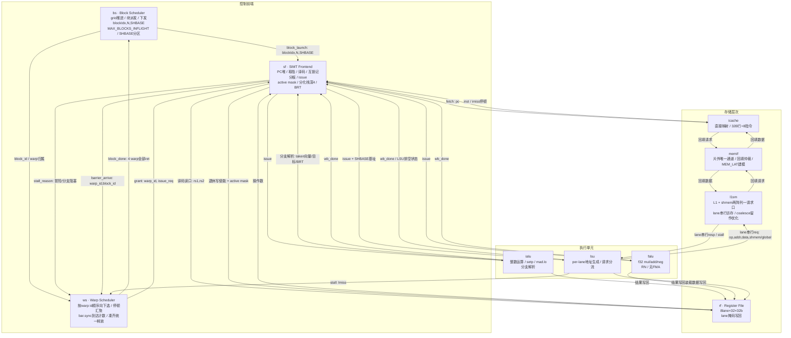

# easy_simt 顶层微架构规范

版本：v0.1（规范文档，基线已冻结）
日期：2026-08-25
修订记录：2026-08-25 分支处理改为**取指阻塞式**（原为"顺序流取指 + taken 冲刷"）：无预测无冲刷，预测+冲刷降为预留优化项；`stall_reason` 去除 `FLUSH`、新增 `BRSTALL`；`BR_PRED` 语义同步更新。
适用范围：本文档定义 easy_simt SIMT 处理器的**顶层微架构**：模块划分、职责边界、模块间接口、流水线组织、调度与分化控制机制、存储子系统策略及参数总表。架构状态与指令语义见同目录 `isa_spec_v0.1.md`（ISA 规范），二者共同构成 RTL 实现与验证的依据。模块级端口定义（Verilog 端口表）不在本文档范围，将按本文档接口逐模块另行出文档。

---

## 1. 设计定位与宪章

本机是**单 kernel 验证原型机**：硬件只执行一个程序（golden kernel `shmem_diverge` 的 easy_simt ISA 汇编），并以其为唯一调试与验证目标。

Golden kernel 语义回顾（硬件版参数）：N=1000，grid=32 块 × 32 线程/块，分化掩码 MASK=16。每线程先做边界判定（gid<N），将全局输入写入共享内存，经 `bar.sync` 同步后读回置换位置（`tid^MASK`）的值；正值数据走 8 次乘加分离的浮点迭代（`r = r*1.0001f + 0.0001f`，ISA 中乘法与加法各一条指令，无 FMA），否则取负；结果写回全局。程序静态 50 条指令，BRT 重聚表 3 个表项 {9→13, 21→46, 46→49}。

**设计宪章：一切最简，能顺序就顺序，能阻塞就阻塞。** 基线的判据是"正确所必需"：每一处与性能相关的机制都以参数位形式存在、默认取最简值。按此定位，后续对原型的**任何改动都构成一次可单独量化收益的优化**（如 coalesce、bank 并行、转发、多块并发等），这也是本项目的演进路线。

据此宪章，v1 明确**不做**：转发/旁路（纯互锁）、分支预测与冲刷（分支阻塞取指）、coalesce（访存按 lane 串行）、bank 并行共享内存（单阵列）、写回/写分配（写直通不分配）、多块并发（`MAX_BLOCKS_INFLIGHT=1`）、例外与中断（非法指令挂起并报错误标志，仅供调试）。

---

## 2. 总体配置

| 项 | 值 | 说明 |
|---|---|---|
| lane 数/warp | 8 | `NLANES=8` |
| warp 数/块 | 4 | `NWARPS=4`，warp id 0..3 |
| 线程数/块 | 32 | 8×4 |
| 块执行方式 | 串行 | `MAX_BLOCKS_INFLIGHT=1`，多块并发留参数位 |
| 架构寄存器 | 32 × 32b | R0 恒零；每 lane 独立副本 |
| 分化栈深度 | 4 | 每 warp 独立 |
| BRT 表项数 | 4 | 汇编器提供重聚点；黄金程序用 3 项 |
| 指令字 | 32b 定长 | 见 ISA 规范 |
| 地址空间 | 32b | 全局/共享统一编址，基址+偏移寻址 |
| 异常 | 无 | 非法指令挂起+错误标志 |

模块总数：**10 个功能模块 + 1 个顶层互连（`top`）**。`top` 只做互连、时钟/复位与全局停顿传递，自身无逻辑。

---

## 3. 流水线

五级、单发射、顺序流水，级间寄存器由 `top` 承载：

| 级 | 所在模块 | 职责 |
|---|---|---|
| IF | sf / icache | 按 ws 授予的 warp 取指；缺失则该 warp 停（imiss）；遇分支阻塞取指等待决议 |
| ID | sf | 译码、立即数扩展、读 rf、互锁检查（记分板） |
| EX | ialu / falu / lsu | 整数/浮点运算、地址生成、分支解析 |
| MEM | lsu / l1sm | lane 串行访存（一拍一个 lane） |
| WB | rf | lane 掩码写回，回报记分板 |

约定：

- **互锁不转发**。数据冒险一律停顿，直到写回完成（记分板清除）后重新发射。转发是第一优化项。
- **无分支预测、无冲刷**。遇分支即阻塞取指，等 EX 级决议完成（ialu 出 taken 向量 → sf 定出下一 PC）再取下一条；不存在错误路径指令与冲刷控制。每条分支付出确定性前端停顿（本时序下量级约 2 拍）；预测+冲刷为预留优化项（见 §11 `BR_PRED`）。
- **阻塞式存储**。任何缺失都停顿发起方（warp 停），不设在途请求表（MSHR）。
- 单发射顺序执行下，写回竞争只可能来自"另一 warp 的 ALU 结果"与"本 warp 装载返回"同拍到达，由写口固定优先级仲裁（见 §10）。

---

## 4. 模块清单与职责

| 模块 | 缩写 | 职责 | 边界说明 |
|---|---|---|---|
| SIMT Frontend | sf | 每 warp 一份 PC；取指发起；定长译码、立即数扩展、`ld.param`；互锁记分板；issue 分派；SIMT 控制（active mask、分化栈、BRT、mask 更新、PC 重定向） | 架构状态之家。分支的**判定**在 ialu，**处置**（压栈/换 mask/重定向）在 sf |
| Warp Scheduler | ws | 按 warp id 顺序选发射；汇聚停顿源；`bar.sync` 到达计数与统一释放；块完成判定（4 warp 全 `ret`） | 只管 warp 粒度行为，不碰块级决策 |
| Block Scheduler | bs | 纯块派发：推进 grid、下发启动上下文 `{blockIdx, N, SHBASE}`、收 `block_done` 拉下一块；`MAX_BLOCKS_INFLIGHT`/SHBASE 分区逻辑的归属 | 不做屏障、不碰每周期行为 |
| 整数 ALU | ialu | IADD/SHL/XOR/mad.lo.s32/setp；分支解析（每 lane taken 向量、目标、BRT 表项）回注 sf | setp 产每 lane 谓词，直接喂分支判定 |
| 浮点 ALU | falu | f32 mul/add/neg，RN 舍入 | 无 FMA |
| Load/Store Unit | lsu | per-lane 地址生成（基址+偏移）、active mask 门控、lane 串行步进、请求分 shmem/global 两路、装载数据引导写回、向 ws 报停顿 | 保持薄：不含 tag 比较、不含阵列 |
| Instruction Cache | icache | 直接映射指令缓存；缺失经 memif 回填、阻塞重放 | 32B 行 = 8 条指令 |
| L1 + Shared Memory | l1sm | 一个请求口挂两块阵列：L1D（命中/缺失/回填）与共享内存（单阵列、SHBASE 寻址） | 行的概念归它管；v1 无 coalesce、无 bank 冲突逻辑 |
| Memory Interface | memif | 片外唯一通道：仲裁 icache/l1sm 回填请求，固定延迟建模 | 单请求在途 |
| Register File | rf | 8 lane × 32×32b；译码双读口；单写口三源仲裁；lane 掩码写回；R0 恒零 | 写数据来自三个执行单元，写使能/掩码来自 sf |

---

## 5. 模块间接口

握手总约定：请求方拉高 `valid` 并保持载荷直至对方 `ready`（能顺序就顺序，能阻塞就阻塞；v1 不要求请求方做复杂撤回逻辑）。下表为语义级定义，信号命名在模块端口文档中固化。

| # | 接口 | 方向 | 载荷 | 语义 |
|---|---|---|---|---|
| 1 | block_launch | bs → sf, ws | `{block_idx, N, shbase}` | 块启动：sf 装载 `ld.param` 上下文并复位各 warp PC 与 SIMT 状态；ws 复位屏障计数与 warp 归属 |
| 2 | block_done | ws → bs | — | 4 个 warp 均执行 `ret`；bs 据此拉下一块 |
| 3 | grant | ws → sf | `{warp_id, issue_req}` | 本周期授予 sf 的发射候选 |
| 4 | stall_reason | sf → ws | `{warp_id, reason}` | 停顿源上报，枚举见 §6.2 |
| 5 | barrier_arrive | sf → ws | `{warp_id, block_id}` | warp 发射 `bar.sync`（前提：该 warp 在 lsu 无未退休访存，见 §6.3） |
| 6 | fetch | sf → icache | `{pc}` | 取指请求，每周期至多一个 |
| 7 | fetch_resp | icache → sf | `{inst}` 或缺失停顿 | 命中一拍返回；缺失期间该请求阻塞 |
| 8 | rf_read | sf → rf | `{rs1, rs2}` | ID 级双读口，操作数随 issue 包下发 |
| 9 | rf_wctrl | sf → rf | `{wen, waddr, lane_mask}` | 退休时随路写使能；掩码为发射时快照（见 §10） |
| 10 | issue | sf → ialu / falu / lsu | `{opcode, rd, 操作数, lane_mask}`；lsu 另含 `shbase` | issue 包；`bar.sync` 不下发执行单元，由 sf 直接走 #5 |
| 11 | branch_res | ialu → sf | `{taken[7:0], target, brt_entry}` | EX 级分支解析回注，sf 据此做 §8 处置 |
| 12 | wb | ialu / falu / lsu → rf | `{wdata}` | 三源共享写口，仲裁见 §10 |
| 13 | wb_done | ialu / falu / lsu → sf | `{warp_id, rd}` | 记分板清除；lsu 借此上报排空状态 |
| 14 | lsu_stall | lsu → ws | `{warp_id, reason=LMISS}` | 缺失阻塞期间停该 warp，其余 warp 照常调度 |
| 15 | mem_req | lsu → l1sm | `{op, is_shmem, addr, wdata}` | lane 串行：每拍一个 lane 的请求，由 lsu 步进（见 §9.2） |
| 16 | mem_resp | l1sm → lsu | `{rdata}` 或停顿 | shmem 命中一拍；L1 命中一拍；缺失阻塞至回填完成 |
| 17 | refill_req | icache / l1sm → memif | `{addr}` | 行填充请求；固定优先级仲裁（icache 优先） |
| 18 | refill_data | memif → icache / l1sm | `{line}` | 固定延迟 `MEM_LAT` 后整行返回 |

---

## 6. Warp 调度（ws）

### 6.1 选择策略

按 **warp id 顺序向下**选择：维护 2 位轮转指针，自指针位置起找第一个可发射（无停顿源）的 warp 发射，发射后指针推进到下一个。无年龄表、无策略表；策略参数 `WS_POLICY` 默认 `ID_ORDER`。

### 6.2 停顿源枚举

`stall_reason ∈ { NONE, HAZARD, IMISS, LMISS, BARRIER, BRSTALL, DONE }`。ws 对每 warp 汇聚各来源：

- HAZARD：sf 记分板互锁；
- IMISS：sf 转发的取指缺失；
- LMISS：lsu 上报的数据缺失；
- BARRIER：已到达 `bar.sync` 等待释放；
- BRSTALL：分支决议中，取指阻塞；
- DONE：该 warp 已执行 `ret`。

### 6.3 屏障流程（bar.sync）

1. `bar.sync` 到达 sf 发射点时，记分板检查**该 warp 在 lsu 无未退休访存**（保证先到屏障者的 `st.shared` 已落地，屏障后读方可见）；未排空则按 HAZARD 互锁。
2. sf 发 `barrier_arrive{warp_id, block_id}`，warp 置 BARRIER 停顿，PC 暂存于屏障次条。
3. ws 按 `block_id` 维护到达计数；凑齐 4 个 warp，同拍清除四者的 BARRIER 并复位计数器，统一释放。

### 6.4 完成判定

warp 执行 `ret` 置 DONE；4 warp 全 DONE 时 ws 发 `block_done`。

---

## 7. 块调度（bs）

- 上电由 `block_launch{0, N, SHBASE}` 启动第 0 块；收到 `block_done` 后 `blockIdx++`，未越界则继续派发，越界则 grid 结束、停机。
- `SHBASE`：共享内存分区基址。v1 单块在途，恒为 0；多块并发时每块分配独立分区，参数 `MAX_BLOCKS_INFLIGHT` 控制并发块数（v1 为 1，逻辑预留）。
- 上下文 `{blockIdx, N}` 供 `ld.param` 读取；`SHBASE` 随 issue 包进入 lsu 作共享内存基址。

---

## 8. SIMT 分化控制（sf 内）

- **状态**：每 warp 一份 active mask（8b）与分化栈（深 4，表项为 `{mask, 重聚PC}`）。
- **判定**（EX 级，ialu 提供每 lane taken 向量）：taken≠0 且 not-taken≠0 方为**分化**；全 taken 或全 not-taken 均为**均匀分支**，不压栈。"全不跳"即均匀分支，不得误判为分化。
- **处置**：
  - 分化：压 `{当前mask, 重聚PC(查BRT)}` 入栈；mask 置为 taken 子集；PC 跳目标。
  - JOIN（到达重聚点）：弹栈恢复 mask；此前汇合路径按栈中 mask 执行。
  - 均匀 taken：直接重定向；均匀 not-taken：顺序流。
- **BRT**：重聚点表由汇编器随程序提供（黄金程序 3 项：{9→13, 21→46, 46→49}），sf 内为只读小表，分支指令携带表项索引。
- 分支重定向（taken 跳转、JOIN 重聚）一律等 EX 级决议完成后生效；决议前 IF 阻塞取指，无冲刷。

---

## 9. 存储子系统

### 9.1 icache

直接映射，32B 行（8 条指令），缺失阻塞：缺失期间该取指请求挂起、warp 停（IMISS），经 #17/#18 回填整行后重放。无预取、无无效化（程序只读，上电后内容不变）。容量参数 `ICACHE_LINES`，默认 16 行（512B，黄金程序静态 50 条=200B，留裕量）。

### 9.2 lsu：lane 串行访存

一条访存指令最多服务 8 个活跃 lane，**每拍发出一个 lane 的请求**（3 位 lane 步进计数器，跳过非活跃 lane）。这是"能顺序就顺序"的直接体现：

- 由此 coalescer 整个省去，`lsu↔l1sm` 接口降为标量请求（#15/#16）；
- 共享内存一拍一个访问，bank 冲突检测逻辑天然消失；
- coalesce 与 bank 并行是首个可插拔优化项。

全部 lane 完成后报 `wb_done`；期间缺失则按 LMISS 停 warp（其余请求顺延，无乱序）。

### 9.3 l1sm

一个请求口，内部按 `is_shmem` 分流到两块**独立阵列**（不做统一 SRAM 分区）：

- **L1D**：直接映射，32B 行，缺失阻塞，**写直通、不写分配**（无脏位、无写回路径）。容量参数 `L1D_LINES`，默认 64 行（2KB）。`ld.global.nc` 的提示位**忽略**，一律走缓存（不实现 bypass 路径）。
- **共享内存**：单阵列，容量参数 `SMEM_BYTES`，默认 512B（黄金程序每块仅用 128B：tile[32]×4B；多块并发时按 `SHBASE` 分区）。地址 = `SHBASE + 偏移`。单口一拍一读/写，v1 无冲突概念。

### 9.4 memif

片外唯一通道。仲裁 icache 与 l1sm 的回填请求，**固定优先级（icache 优先）**，单请求在途；片外延迟建模为固定值 `MEM_LAT`（默认 20，与 ISS 基线同参）。请求队列留参数位，v1 不实现。

---

## 10. 寄存器堆（rf）与写回

- 组织：8 lane × 32 寄存器 × 32b，每 lane 独立；R0 恒零（写忽略、读恒 0）。
- 读：ID 级双读口（rs1/rs2），操作数随 issue 包下发。
- 写：单写口，三源固定优先级仲裁 **lsu > ialu > falu**（v1 单发射顺序下竞争窗口极小，仲裁仅为结构正确性兜底）。
- **lane 掩码随路**：发射时 sf 快照当前 active mask 进入 issue 包，WB 时作为写使能——分化路径上的指令只写活跃 lane，语义与 ISA 规范一致。

---

## 11. 参数总表

所有参数留位、默认取最简值；改动任一参数即一次受控实验。

| 参数 | 默认 | 含义 | 优化方向 |
|---|---|---|---|
| `NLANES` | 8 | lane/warp | — |
| `NWARPS` | 4 | warp/块 | — |
| `MAX_BLOCKS_INFLIGHT` | 1 | 并发块数 | 多块并发 |
| `WS_POLICY` | ID_ORDER | warp 选择策略 | oldest-first / GTO |
| `DIV_STACK_DEPTH` | 4 | 分化栈深 | — |
| `BRT_ENTRIES` | 4 | 重聚表表项 | — |
| `ILINE_B` | 32 | 指令行字节数 | — |
| `ICACHE_LINES` | 16 | icache 行数（512B） | 容量/相联度 |
| `L1D_LINES` | 64 | L1D 行数（2KB） | 容量/相联度 |
| `WRITE_POLICY` | WT_NOALLOC | 写策略 | 写分配/写回 |
| `SMEM_BYTES` | 512 | 共享内存容量 | 分 bank 并行 |
| `LSU_LANE_SERIAL` | 1 | lane 串行访存 | coalesce/多 lane 并行 |
| `MEM_LAT` | 20 | 片外固定延迟 | 突发/多通道 |
| `FORWARD` | 0 | 转发/旁路 | 开启 |
| `BR_PRED` | 0 | 分支处理方式（0=阻塞取指，无预测无冲刷） | 开启后引入预测与冲刷 |

---

## 12. 验证与验收

**参考体系**：`assembler/easy_simt_assembler_verify.py`（内含功能级 ISS）为**纯功能位精确参考**——v1 引入 icache/L1 后，RTL 周期数与 ISS 不再具备可比性，周期只作观测项，不作验收项；功能比对仍以输出数据位精确为准。GPGPU-Sim SM7_TITANV 数据（735 周期、37424 warp 指令、IPC 50.92、shmem_insn=2048、数据分支 32 warp 全分化、边界分化 1 warp）作为 32-lane 粒度的外部对照，用于解读而非验收。

黄金用例 T3：`N=1000, grid=32, MASK=16`（硬件版，128 warp）。验收项：

| # | 验收项 | 期望 | 观测点 |
|---|---|---|---|
| V1 | 功能位精确 | `out[]` 与 ISS 逐位一致（误差 0） | tb 比对 |
| V2 | 共享内存访问次数 | 2048（与基线 shmem_insn 完全一致） | l1sm 计数 |
| V3 | 数据分支分化 | 125/128 warp（8-lane 粒度） | sf 分化计数 |
| V4 | 边界分支分化 | 0（1000=125×8 恰在 warp 边界，属 8-lane 粒度伪像；如需复现边界分化需取 N 非 8 倍数） | sf 分化计数 |
| V5 | 无死锁 | 4 屏障×32 块全部释放、`ret` 正常收束、grid 停机 | tb 超时断言 |

V3 与 32-lane 基线"全分化"的差异纯属粒度效应：8 lane 下部分 warp 恰好整 warp 同号，属预期行为，ISS 已给出同粒度对照数据。

---

## 附录 A：模块互连图

