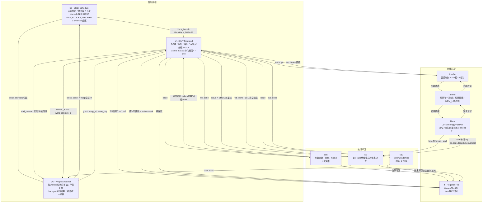

# easy_simt 顶层微架构规范

版本：v0.1（规范文档，基线已冻结；v0.2 重构：宏观内容收拢至第 1 节，模块逐节成文）
日期：2026-08-25
修订记录：2026-08-25 分支处理改为**取指阻塞式**（原为"顺序流取指 + taken 冲刷"）：无预测无冲刷，预测+冲刷降为预留优化项；`stall_reason` 去除 `FLUSH`、新增 `BRSTALL`；`BR_PRED` 语义同步更新。
适用范围：本文档定义 easy_simt SIMT 处理器的**顶层微架构**：模块划分、职责边界、模块间接口、调度与分化控制机制、存储子系统策略及参数总表。架构状态与指令语义见同目录 `isa_spec_v0.1.md`（ISA 规范），二者共同构成 RTL 实现与验证的依据。信号级端口定义见同目录 `intf_spec_v0.1.md`（接口规范）。

---

## 1. 总体

### 1.1 设计定位与宪章

本机是**单 kernel 验证原型机**：硬件只执行一个程序（golden kernel `shmem_diverge` 的 easy_simt ISA 汇编），并以其为唯一调试与验证目标。

Golden kernel 语义回顾（硬件版参数）：N=1000，grid=32 块 × 32 线程/块，分化掩码 MASK=16。每线程先做边界判定（gid<N），将全局输入写入共享内存，经 `bar.sync` 同步后读回置换位置（`tid^MASK`）的值；正值数据走 8 次乘加分离的浮点迭代（`r = r*1.0001f + 0.0001f`，ISA 中乘法与加法各一条指令，无 FMA），否则取负；结果写回全局。程序静态 50 条指令，BRT 重聚表 3 个表项 {9→13, 21→46, 46→49}。

**设计宪章：一切最简，能顺序就顺序，能阻塞就阻塞。** 基线的判据是"正确所必需"：每一处与性能相关的机制都以参数位形式存在、默认取最简值。按此定位，后续对原型的**任何改动都构成一次可单独量化收益的优化**（如 coalesce、bank 并行、转发、多块并发等），这也是本项目的演进路线。

据此宪章，v1 明确**不做**：转发/旁路（纯互锁）、分支预测与冲刷（分支阻塞取指）、coalesce（8-bank 按字偏移天然分流，仅跨行才串行）、写回/写分配（写直通不分配）、多块并发（`MAX_BLOCKS_INFLIGHT=1`）、例外与中断（非法指令挂起并报错误标志，仅供调试）。

### 1.2 总体配置

| 项 | 值 | 说明 |
|---|---|---|
| lane 数/warp | 8 | `NLANES=8` |
| warp 数/块 | 4 | `NWARPS=4`，warp id 0..3 |
| 线程数/块 | 32 | 8×4 |
| 块执行方式 | 串行 | `MAX_BLOCKS_INFLIGHT=1`，多块并发留参数位 |
| 架构寄存器 | 32 × 32b | R0 恒零；每 lane 独立副本 |
| 分化栈深度 | 4 | 每 warp 独立 |
| BRT 表项数 | 4 | 汇编器提供重聚点；黄金程序用 3 项 |
| 指令字 | 32b 定长 | 见 ISA 规范 |
| 地址空间 | 32b | 全局/共享统一编址，基址+偏移寻址 |
| 异常 | 无 | 非法指令挂起+错误标志 |

模块总数：**10 个功能模块 + 1 个顶层互连（`top`）**。`top` 只做互连、时钟/复位与全局停顿传递，自身无逻辑。

### 1.3 执行约定（模块分工）

不引入 CPU 式分级流水概念。指令按模块分工、单发射、顺序完成：**sf** 取指/译码/发射 → **ialu/falu/lsu** 执行 → **l1sm** 访存 → **rf** 写回。各模块职责见 §2–§11。

约定：

- **互锁不转发**。数据冒险一律停顿，直到写回完成（记分板清除）后重新发射。转发是第一优化项。
- **无分支预测、无冲刷**。遇分支即阻塞取指，等 ialu 决议完成（出 taken 向量 → sf 定出下一 PC）再取下一条；不存在错误路径指令与冲刷控制。每条分支付出确定性前端停顿（量级约 2 拍）；预测+冲刷为预留优化项（见 §1.6 `BR_PRED`）。
- **阻塞式存储**。任何缺失都停顿发起方（warp 停），不设在途请求表（MSHR）。
- 单发射顺序执行下，写回竞争只可能来自"另一 warp 的 ALU 结果"与"本 warp 装载返回"同拍到达，由写口固定优先级仲裁（见 §11 rf）。

### 1.4 模块清单与职责

| 模块 | 缩写 | 职责 | 边界说明 | 章节 |
|---|---|---|---|---|
| SIMT Frontend | sf | 每 warp 一份 PC；取指发起；定长译码、立即数扩展、`ld.param`；互锁记分板；issue 分派；SIMT 控制（active mask、分化栈、BRT、mask 更新、PC 重定向） | 架构状态之家。分支的**判定**在 ialu，**处置**（压栈/换 mask/重定向）在 sf | §2 |
| Warp Scheduler | ws | 按 warp id 顺序选发射；汇聚停顿源；`bar.sync` 到达计数与统一释放；块完成判定（4 warp 全 `ret`） | 只管 warp 粒度行为，不碰块级决策 | §3 |
| Block Scheduler | bs | 纯块派发：推进 grid、下发启动上下文 `{blockIdx, N, SHBASE}`、收 `block_done` 拉下一块；`MAX_BLOCKS_INFLIGHT`/SHBASE 分区逻辑的归属 | 不做屏障、不碰每周期行为 | §4 |
| 整数 ALU | ialu | IADD/SHL/XOR/mad.lo.s32/setp；分支解析（每 lane taken 向量、目标、BRT 表项）回注 sf | setp 产每 lane 谓词，直接喂分支判定 | §5 |
| 浮点 ALU | falu | f32 mul/add/neg，RN 舍入 | 无 FMA | §6 |
| Load/Store Unit | lsu | per-lane 地址生成（基址+偏移）、active mask 门控、8-lane 锁步一拍发出、请求分 shmem/global 两路、装载数据引导写回、向 ws 报停顿 | 保持薄：不含 tag 比较、不含阵列/bank | §7 |
| Instruction Cache | icache | 直接映射指令缓存；缺失经 memif 回填、阻塞重放 | 32B 行 = 8 条指令 | §8 |
| L1 + Shared Memory | l1sm | 统一 SRAM（8 bank），L1 与共享内存共享；类位+钉扎自指标签管理；缺失阻塞、写直通不写分配 | 行的概念归它管；8-bank 锁步、单行单拍，跨行/冲突才串行；无 coalesce | §9 |
| Memory Interface | memif | 片外唯一通道：仲裁 icache/l1sm 回填请求，固定延迟建模 | 单请求在途 | §10 |
| Register File | rf | 8 lane × 32×32b；译码双读口；单写口三源仲裁；lane 掩码写回；R0 恒零 | 写数据来自三个执行单元，写使能/掩码来自 sf | §11 |

### 1.5 模块互连图

### 1.6 参数总表

所有参数留位、默认取最简值；改动任一参数即一次受控实验。

| 参数 | 默认 | 含义 | 优化方向 |
|---|---|---|---|
| `NLANES` | 8 | lane/warp | — |
| `NWARPS` | 4 | warp/块 | — |
| `MAX_BLOCKS_INFLIGHT` | 1 | 并发块数 | 多块并发 |
| `WS_POLICY` | ID_ORDER | warp 选择策略 | oldest-first / GTO |
| `DIV_STACK_DEPTH` | 4 | 分化栈深 | — |
| `BRT_ENTRIES` | 4 | 重聚表表项 | — |
| `ILINE_B` | 32 | 指令行字节数 | — |
| `ICACHE_LINES` | 16 | icache 行数（512B） | 容量/相联度 |
| `U_LINES` | 64 | 统一 SRAM 总行数（L1+SM 共享，2KB） | 容量/相联度 |
| `WRITE_POLICY` | WT_NOALLOC | 写策略 | 写分配/写回 |
| `SM_LINES` | 4 | SM 分区行数（块启动时设定、钉扎；黄金程序 128B=4 行） | SM 容量 / 分 bank 并行 |
| `NBANKS` | 8 | l1sm bank 数（=NLANES，锁步单拍） | bank 数 |
| `MEM_LAT` | 20 | 片外固定延迟 | 突发/多通道 |
| `FORWARD` | 0 | 转发/旁路 | 开启 |
| `BR_PRED` | 0 | 分支处理方式（0=阻塞取指，无预测无冲刷） | 开启后引入预测与冲刷 |

### 1.7 验证与验收

**参考体系**：`assembler/easy_simt_assembler_verify.py`（内含功能级 ISS）为**纯功能位精确参考**——v1 引入 icache/L1 后，RTL 周期数与 ISS 不再具备可比性，周期只作观测项，不作验收项；功能比对仍以输出数据位精确为准。GPGPU-Sim SM7_TITANV 数据（735 周期、37424 warp 指令、IPC 50.92、shmem_insn=2048、数据分支 32 warp 全分化、边界分化 1 warp）作为 32-lane 粒度的外部对照，用于解读而非验收。

黄金用例 T3：`N=1000, grid=32, MASK=16`（硬件版，128 warp）。验收项：

| # | 验收项 | 期望 | 观测点 |
|---|---|---|---|
| V1 | 功能位精确 | `out[]` 与 ISS 逐位一致（误差 0） | tb 比对 |
| V2 | 共享内存访问次数 | 2048（与基线 shmem_insn 完全一致） | l1sm 计数 |
| V3 | 数据分支分化 | 125/128 warp（8-lane 粒度） | sf 分化计数 |
| V4 | 边界分支分化 | 0（1000=125×8 恰在 warp 边界，属 8-lane 粒度伪像；如需复现边界分化需取 N 非 8 倍数） | sf 分化计数 |
| V5 | 无死锁 | 4 屏障×32 块全部释放、`ret` 正常收束、grid 停机 | tb 超时断言 |

V3 与 32-lane 基线"全分化"的差异纯属粒度效应：8 lane 下部分 warp 恰好整 warp 同号，属预期行为，ISS 已给出同粒度对照数据。

---

## 2. sf — SIMT Frontend

**职责**：架构状态之家。每 warp 一份 PC、active mask（8b）、分化栈（深 4，表项 `{mask, 重聚PC}`）；取指发起、定长译码、立即数扩展、`ld.param`；互锁记分板；issue 分派；SIMT 分化控制。分支的**判定**在 ialu，**处置**在 sf。

**取指**：按 ws 授予（`grant{warp_id}`）向 icache 发 `fetch{pc}`，收 `fetch_resp{inst}`；缺失期间该 warp 停（IMISS）。遇分支阻塞取指，等 ialu 决议后取下一条，无冲刷。

**互锁记分板**：数据冒险停顿至写回完成（`wb_done` 清除）。`bar.sync` 到达发射点时检查**该 warp 在 lsu 无未退休访存**，未排空按 HAZARD 互锁（屏障可见性兜底）。

**分化控制**：

- **判定**（ialu 经 `branch_res{taken[7:0], target, brt_entry}` 回注）：taken≠0 且 not-taken≠0 方为**分化**；全 taken 或全 not-taken 均为**均匀分支**，不压栈。"全不跳"即均匀分支，不得误判为分化。
- **处置**：分化→压 `{当前mask, 重聚PC(查BRT)}` 入栈、mask 置 taken 子集、PC 跳目标；JOIN→弹栈恢复 mask；均匀 taken→直接重定向；均匀 not-taken→顺序流。
- **BRT**：重聚点表由汇编器随程序提供（黄金程序 3 项 {9→13, 21→46, 46→49}），sf 内为只读小表，分支指令携带表项索引。
- 重定向一律等 ialu 决议完成后生效；决议前 sf 阻塞取指，无冲刷。

**接口**：收 `bs_sf_launch`（装载 `ld.param` 上下文、复位各 warp PC 与 SIMT 状态）、`ws_sf_grant`、`icache_sf_rsp`、`rf→sf 操作数`、`{ialu,falu,lsu}→sf wb_done`、`ialu_sf_br`；发 `sf_ws_stall{warp_id,reason}`、`sf_ws_bar{warp_id,block_id}`、`sf_icache_req{pc}`、`sf→rf 读口{rs1,rs2}`、`sf→rf 写使能{wen,waddr,lane_mask}`（掩码为发射时快照）、`sf→{ialu,falu,lsu} issue`（lsu 另含 `shbase`；`bar.sync` 不下发执行单元，由 sf 直接走 barrier_arrive）。

## 3. ws — Warp Scheduler

**职责**：只管 warp 粒度行为，不碰块级决策。按 warp id 顺序选发射；汇聚停顿源；`bar.sync` 到达计数与统一释放；块完成判定。

**选择策略**：维护 2 位轮转指针，自指针位置起找第一个可发射（无停顿源）的 warp 发射，发射后指针推进。无年龄表、无策略表；策略参数 `WS_POLICY` 默认 `ID_ORDER`。

**停顿源枚举**：`stall_reason ∈ { NONE, HAZARD, IMISS, LMISS, BARRIER, BRSTALL, DONE }`，对每 warp 汇聚各来源：HAZARD（sf 记分板互锁）、IMISS（sf 转发取指缺失）、LMISS（lsu 上报数据缺失）、BARRIER（等屏障）、BRSTALL（分支决议中）、DONE（已 `ret`）。

**屏障流程**：sf 发 `barrier_arrive{warp_id, block_id}` 后 warp 置 BARRIER、PC 暂存于屏障次条；ws 按 `block_id` 计数，凑齐 4 个 warp 同拍清除四者 BARRIER 并复位计数器、统一释放。

**完成判定**：warp `ret` 置 DONE；4 warp 全 DONE 发 `block_done`。

**接口**：收 `bs_ws_launch`、`sf_ws_stall`、`sf_ws_bar`、`lsu_ws_stall`；发 `ws_sf_grant{warp_id,issue_req}`、`ws_bs_bdone`。

## 4. bs — Block Scheduler

**职责**：纯块派发，不做屏障、不碰每周期行为。推进 grid、下发启动上下文、收 `block_done` 拉下一块；`MAX_BLOCKS_INFLIGHT`/SHBASE 分区逻辑的归属。

**流程**：上电由 `block_launch{0, N, SHBASE}` 启动第 0 块；收到 `block_done` 后 `blockIdx++`，未越界继续派发，越界则 grid 结束、停机。

**上下文**：`{blockIdx, N}` 供 `ld.param` 读取；`SHBASE` 随 issue 包进入 lsu 作共享内存基址。v1 单块在途 SHBASE 恒为 0；多块并发时每块独立分区，参数 `MAX_BLOCKS_INFLIGHT` 控制（v1 为 1，逻辑预留）。

**接口**：发 `bs_sf_launch{block_idx,N,shbase}`、`bs_ws_launch{block_id/warp归属}`；收 `ws_bs_bdone`。

## 5. ialu — Integer ALU

**职责**：整数运算 + 分支解析。IADD/SHL/XOR/mad.lo.s32/setp；setp 产每 lane 谓词直接喂分支判定。数据通路 **8 lane 并行、锁步**：一拍对 8 个 lane 同时运算，产出 wdata[8×32]。

**分支解析**：算出每 lane taken 向量、跳转目标、BRT 表项索引，经 `ialu_sf_br` 回注 sf（判定在 ialu、处置在 sf）。

**接口**：收 `sf_ialu_issue`；发 `ialu_sf_br{taken[7:0],target,brt_entry}`、`ialu_rf_wb{wdata}`、`ialu_sf_wbdone{warp_id,rd}`。

## 6. falu — Floating-point ALU

**职责**：f32 mul/add/neg，RN 舍入。**无 FMA**（对应 ISA 不提供 FMA、`-fmad=false` 语义）。数据通路 **8 lane 并行、锁步**：一拍对 8 个 lane 同时运算，产出 wdata[8×32]。

**接口**：收 `sf_falu_issue`；发 `falu_rf_wb{wdata}`、`falu_sf_wbdone{warp_id,rd}`。

## 7. lsu — Load/Store Unit

**职责**：保持薄——不含 tag 比较、不含阵列/bank。per-lane 地址生成（基址+偏移）、active mask 门控、**8-lane 锁步**一拍发出一个 8-lane 请求、请求分 shmem/global 两路、装载数据引导写回、向 ws 报停顿。

**8-lane 锁步**：与 ialu/falu 口径一致，lsu 数据通路 8 lane 宽、锁步执行——一条访存指令在一拍内对全部活跃 lane 同时生成地址、发起访问，**不逐 lane 串行**。地址 = 基址（issue 包随路，每 lane 一份）+ 符号扩展偏移；共享内存再叠 bs 下发的 SHBASE。操作码区分 LDG/STG/LDS/STS；mask 外 lane 不发起访问。

**接口**：收 `sf_lsu_issue`（含 `shbase`）；发 `lsu_l1sm_req{rw,sm,addr[8×32],wdata[8×32],mask[8]}`、`lsu_ws_stall{warp_id,reason=LMISS}`、`lsu_rf_wb{wdata[8×32]}`、`lsu_sf_wbdone{warp_id,rd}`（借此上报排空状态）；收 `l1sm_lsu_rsp{rdata[8×32]}`。写通存储等写应答返回才算完成。

## 8. icache — Instruction Cache

**职责**：直接映射指令缓存，32B 行（8 条指令）。缺失阻塞：缺失期间该取指请求挂起、warp 停（IMISS），经 memif 回填整行后重放。无预取、无无效化（程序只读，上电后内容不变）。容量参数 `ICACHE_LINES` 默认 16 行（512B，黄金程序静态 50 条=200B，留裕量）。

**接口**：收 `sf_icache_req{pc}`；发 `icache_sf_rsp{inst}`、`icache_memif_req{addr}`；收 `memif_icache_rsp{line}`。

## 9. l1sm — L1 + Shared Memory（统一 SRAM）

**职责**：L1 与共享内存**共用一块统一 SRAM**（数据阵列按字偏移分 8 bank + 一份 tag 阵列），行的概念归它管；v1 无 coalesce。内部按 `is_shmem` 分流到两套 tag 规约。

**物理组织**：`U_LINES` 行 × 32B 数据，按字偏移分 `NBANKS=8` bank（bank=addr[4:2]，与 NLANES 对齐）；tag 阵列 `U_LINES` 项，每项 `{class[1:0], valid, tag}`。class 编码：00=INVALID、01=L1、10=SM（钉扎）。分区寄存器 `SM_LINES` 在块启动时设定：行 `[0, SM_LINES)` 归 SM，行 `[SM_LINES, U_LINES)` 归 L1。默认 `U_LINES=64`、`SM_LINES=4`。

**tag 管理策略（类位 + 钉扎自指标签）**：

- **SM 侧（钉扎自指哨兵）**：块启动时对 `[0, SM_LINES)` 每行写一次 tag：`tag := 该行自身索引`（自指哨兵）、`class:=SM`、`valid:=1`、钉扎。SM 请求 `sm_line=(addr-SHBASE)>>5` 直接落物理行 sm_line，查 tag 做 `class==SM && valid` 的恒等/类校验——SM **不会缺失、不可被替换**，tag 阵列在此兼任完整性校验。
- **L1 侧（偏移索引、正常 tag）**：`n=U_LINES-SM_LINES`，`set=fn(addr) mod n`，物理行 = `SM_LINES+set`；命中条件 `class==L1 && valid && tag==addr_tag`。缺失阻塞、回填整行后以 `class=L1` 覆写分配（直接映射）。L1 索引空间整体偏移到 SM 区之上，**两套规约永不互相别名**，L1 替换永不触碰 SM 钉扎行。
- **无脏位**：写直通、不写分配，tag 仅 `{class, valid, tag}` 三字段，保持最小。

**8-bank 锁步访问**：接收 lsu 的 8-lane 请求后，若全部活跃 lane 落在**同一行**且 8 个 bank 互不冲突，则**单拍完成**（一次行级 tag 比较 + 8 bank 并行读/写）；若跨行或 bank 冲突，则整拍串行（停顿重发），属例外而非常态——不是逐 lane 串行的基线机制。黄金程序 stride-1 访问恒为单行、8 bank 无冲突，故每条访存指令单拍完成，与基线"无 bank conflict"一致。

**特性**：直接映射；缺失阻塞；写直通不写分配；8-bank 锁步；`ld.global.nc` 提示位忽略，一律走缓存（不实现 bypass 路径）。

**接口**：收 `lsu_l1sm_req{rw,sm,addr[8×32],wdata[8×32],mask[8]}`；发 `l1sm_lsu_rsp{rdata[8×32]}`（单行单拍；缺失阻塞至回填完成）、`l1sm_memif_req{addr}`；收 `memif_l1sm_rsp{line}`。

## 10. memif — Memory Interface

**职责**：片外唯一通道。仲裁 icache 与 l1sm 的回填请求，**固定优先级（icache 优先）**，单请求在途；片外延迟建模为固定值 `MEM_LAT`（默认 20，与 ISS 基线同参）。请求队列留参数位，v1 不实现。对外为 AXI4 主设备（信号级见接口规范）。

**接口**：收 `icache_memif_req{addr}`、`l1sm_memif_req{addr}`；发 `memif_icache_rsp{line}`、`memif_l1sm_rsp{line}`；对外 AXI4（AW/W/B/AR/R）。

## 11. rf — Register File

**职责**：8 lane × 32 寄存器 × 32b，每 lane 独立；R0 恒零（写忽略、读恒 0）。

**读**：译码时双读口（rs1/rs2），操作数随 issue 包下发。

**写**：单写口，三源固定优先级仲裁 **lsu > ialu > falu**（v1 单发射顺序下竞争窗口极小，仲裁仅为结构正确性兜底）。

**lane 掩码随路**：发射时 sf 快照当前 active mask 进入 issue 包，写回时作为写使能——分化路径上的指令只写活跃 lane，语义与 ISA 规范一致。

**接口**：收 `sf_rf_rd{rs1,rs2}`、`sf_rf_wctrl{wen,waddr,lane_mask}`、`{ialu,falu,lsu}_rf_wb{wdata}`；发 `rf→sf 操作数`。
